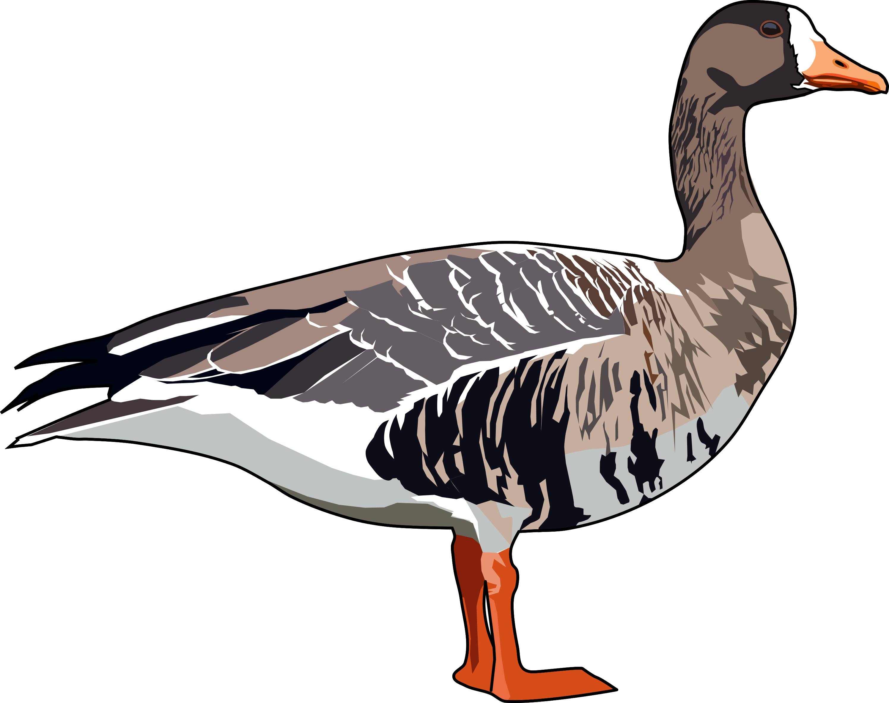

## Links to my research 🔗

Click [here](https://scholar.google.co.uk/citations?user=9VyBol4AAAAJ&hl=en) for my Google Scholar profile

## Application of Stable Istopes in Ecology

### Univeristy of Exeter
I work on the application of Stable Isotopes in ecology. mainly to understand the diet, niches and origins of birds. My recent work has involved understanding diet in Kirtland's Warbler and how diet contribution alter body condition as well as using hydrogen isotopes to understand the origins of migratory *Phylloscopus* warblers in the UK.  

## Future conservation scenarios for lowland breeding waders in England

#### Conservation Scientist: RSPB 🥚🐣

Wading birds breeding on lowland wet grassland have declined in recent years, especially Lapwing, Snipe and Curlew. We hope to use breeding abundance data from a nationwide survey to model the field-level and wider landscape-level factors that drive breeding abundance. From this model we will predict the impact of proposed future conservation scenarios on breeding wader populations. These scenarios will focus on three key regions with nationally important populations of lowland breeding waders (Somerset Levels, Norfolk Broads and Greater Thames)

{fig-align="center" width="240"}

## Released Gambird Dispseral in the UK

#### Postdoctoral Research: University of Exeter 🦚 🔫

I investigated the movement and wider dispersal of Common Pheasants *Phasianus colchicus* to help retain birds near shoots and to limit dispersal into protected areas. I used GPS tracking data and radio tracking data to build an individual-based model that simulate the movement of released pheasant from any point in the UK. This allowed assessment of the number of pheasants that would occur in protected area on a temporally dynamic scale.

::: {.callout-tip collapse="true" appearance="minimal"}
##### Publications

[@wilde2026]
:::

## Analysing Animal Movement data

#### ExMove: Univeristy of Exeter 🐾 📊

Alongside other postdoctoral researchers we created a toolkit for processing biologging data from tag downloads to archiving in online data base. The code is open-access and serves as a self-teaching guide for both new and more advanced users. The code is available from a GitHub repository [here](https://github.com/ExMove/ExMove). I also built a shiny app that allows users to explore their data using a user friendly GUI, this can be accessed [here](https://lukeozsanlav.shinyapps.io/exmove_explorer/).

::: {.callout-tip collapse="true" appearance="minimal"}
##### Publications

[@langley2024]
:::

{fig-align="center" width="165"}

## Collision Risk Modelling of Seabirds with Offshore Wind Turbines

#### Contracted Work: JNCC 🌊🌊

I lead a review of the avoidance rate parameter used in the collision risk modelling of seabirds which is a key part of the consenting process for offshore wind developments. I reviewed and assessed available literature that contained data that could be used to derive estimates of the avoidance rate parameter. Avoidance rates were calculated using this data with two variants of the Band (2012) collision risk model and their stochastic implementations. Estimates were compared to previous industry standards in (Cook 2021) and we found increases in the avoidance rates for the following species groupings: all gulls, large gulls, and all gulls & terns. A link to the report and supporting materials can be found [here.](https://hub.jncc.gov.uk/assets/de5903fe-81c5-4a37-a5bc-387cf704924d)

::: {.callout-tip collapse="true" appearance="minimal"}
##### Report

Ozsanlav-Harris, L., Inger, R. & Sherley, R. 2023. Review of data used to calculate avoidance rates for collision risk modelling of seabirds. JNCC Report 732, JNCC, Peterborough, ISSN 0963-8091. https://hub.jncc.gov.uk/assets/de5903fe-81c5-4a37-a5bc-387cf704924d

:::

## Isle of Rum Manx Shearwater Census

#### Contracted Work: MarPAMM 🌊⛰️

I was part of the fieldwork team that carried out occupancy surveys across the entire Manx Shearwater colony. I subsequently lead the spatial side of the analysis to extrapolate the number of occupied burrows across the entire colony from the limited number of survey plots. A link to this report can be found [here.](https://www.mpa-management.eu/wp-content/uploads/2023/06/Surveys-of-Breeding-Cliff-nesting-Seabirds-Ground-nesting-Seabirds-and-Burrow-nesting-Seabirds-in-Western-Scotland.pdf) 

::: {.callout-tip collapse="true" appearance="minimal"}
##### Report

Inger R, Sherley RB, Lennon J, Winn N, Scriven N, Ozsanlav-Harris L and Bearhop S. 2022. Surveys of Breeding Cliff-nesting Seabirds, Ground-nesting Seabirds and Burrow-nesting Seabirds in Western Scotland. Report to Agri-Food and Biosciences Institute and Marine Scotland Science as part of the Marine Protected Area Management and Monitoring (MarPAMM) project.

:::

## Diagnosing the decline of Greenland-White-fronted Geese

#### PhD Research: Univeristy of Exeter 🦆 📉

I carried out a PhD at the University of Exeter to understand the decline of a migratory waterfowl species, the Greenland White-fronted Goose *Anser albifrons flavirostris*. I investigated different factors that could be contributing to population decline. This included lead poisoning and shooting disturbance on Islay, Scotland from shooting of the Barnacle Goose population on the island. I also investigated how changes to the climate in the Western Greenland breeding grounds could be causing low breeding success across the population. To fully investigate this we deployed biologging devices across the wintering range and remotely examined breeding using remote sensing data and biologging data to remotely classify breeding events.

::: {.callout-tip collapse="true" appearance="minimal"}
##### Publications

[@ozsanlav-harris2024]

[@mcintosh2023]

[@ozsanlav-harris2023]

[@ozsanlav-harris2022]
:::

{fig-align="center" width="221"}
